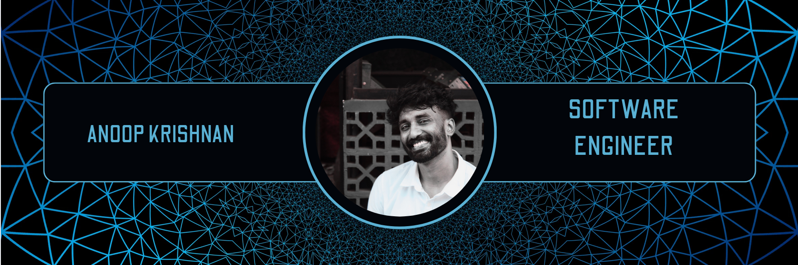

<h2 align="left">Hi 👋! My name is Anoop Krishnan Ramachandran.</h2>

###

I'm a Software Engineer with around 4 years of experience specializing in building scalable web applications. My journey in tech began with a Computer Application degree, and I've since worked with various technologies and frameworks to create robust, high-performance solutions.

###

<h3>My Tech Stack</h3>

      

 

  
  

 

<!-- <table border="1" align="left"><tr><td>
  <picture>
    <source media="(prefers-color-scheme: dark)" srcset="https://raw.githubusercontent.com/Anoop4u777/Anoop4u777/output/github-snake-dark.svg" />
    <source media="(prefers-color-scheme: light)" srcset="https://raw.githubusercontent.com/Anoop4u777/Anoop4u777/output/github-snake.svg" />
    
  </picture>
</td></tr></table> -->

  <h3>Connect with me</h3>
  
  
  

